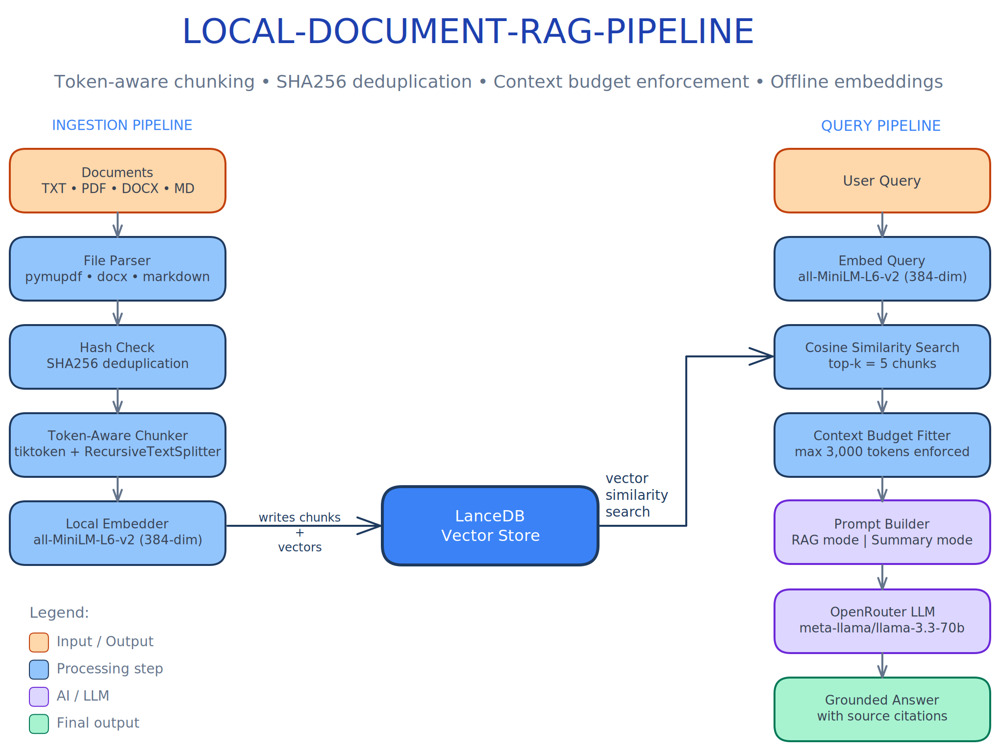

# local-document-rag-pipeline (CLI)

> **A local CLI RAG system that ingests your documents and answers questions about them -with token-aware chunking, SHA256 deduplication, and strict context budgeting. Runs fully offline except the final LLM call.**


---

## What makes this different

Most RAG demos chunk by character count, skip deduplication, and send unbounded context to the LLM. This project is built around three engineering decisions that matter in production:

| Decision | Why it matters |
|---|---|
| **Token-aware chunking** | LLMs think in tokens, not characters. A 500-char chunk can be 80–200 tokens depending on content. Splitting by tokens gives predictable embedding and context behaviour. |
| **SHA256 file deduplication** | Re-running `--ingest` on the same folder is safe. Files are hashed before ingestion -unchanged files are skipped entirely. |
| **Context budget enforcement** | `fit_chunks_to_context()` trims the retrieved chunk list to fit within `MAX_CONTEXT_TOKENS` before the LLM sees it. No prompt overflow, ever. |

---

## Architecture




> 📐 Interactive diagram: [`docs/architecture.excalidraw`](./docs/architecture.excalidraw) - open at [excalidraw.com](https://excalidraw.com) or with the VS Code Excalidraw extension.
---

## Quick Start

### 1. Prerequisites

- **Python 3.11.x** -do NOT use 3.12 (`torch` breaks silently)
- An **OpenRouter API key** from [openrouter.ai](https://openrouter.ai)

### 2. Clone and install

```bash
git clone <your-repo>
cd local-document-rag-pipeline

python -m venv .venv
.venv\Scripts\activate        # Windows
# source .venv/bin/activate   # Mac/Linux

pip install -r requirements.txt
```

### 3. Configure

```bash
cp .env.example .env
# Edit .env with your API key
```

```env
OPENROUTER_API_KEY=sk-or-v1-...
OPENROUTER_MODEL=meta-llama/llama-3.3-70b-instruct
MAX_CHUNK_TOKENS=150
MAX_CONTEXT_TOKENS=3000
TOP_K=5
```

> **OpenRouter note:** Go to [openrouter.ai/settings/privacy](https://openrouter.ai/settings/privacy) and turn **OFF** "Always enforce ZDR" -otherwise many models return 404.

### 4. Download the embedding model (once)

```bash
python scripts/setup_model.py
```

This downloads `all-MiniLM-L6-v2` to `./models/` for fully offline embedding. Never let it download at query time.

---

## Usage

> **Every session** -activate the virtual environment before running any command:
> ```bash
> # Windows
> .venv\Scripts\activate
>
> # Mac / Linux
> source .venv/bin/activate
> ```
> Your prompt will show `(.venv)` when it's active. All `python` and `pip` commands below assume the venv is activated.

---

### Ingest documents

```bash
python main.py --ingest ./docs
```

```
[INGEST] report.pdf        → 14 chunks  (1,842 tokens)
[INGEST] notes.md          →  9 chunks    (873 tokens)
[SKIP]   intro.txt         already ingested (hash match)
Done. 23 new chunks stored.
```

Recursively finds all `.txt`, `.pdf`, `.docx`, `.md` files. Files already ingested (same SHA256 hash) are skipped -safe to re-run on the same folder.

### Query interactively

```bash
python main.py --query
```

```
>> what is a vector database?
[RAG MODE] Retrieved 5 chunks (2,104 tokens)

A vector database stores high-dimensional vectors and enables similarity search...
Sources: intro.txt, report.pdf
```

The pipeline auto-detects **summary intent** (`summarize`, `overview`, `tldr`, `explain all`) and switches to a summarization prompt. All other queries use strict RAG mode with source attribution.

### Force re-ingest (after document updates)

```bash
python main.py --reingest ./docs
```

Deletes existing chunks for each file and re-embeds from scratch.

### View database stats

```bash
python main.py --stats
```

```
DB Stats:
  Total chunks : 24
  Unique files : 6

Ingested files:
  intro.txt    - 1 chunk
  report.pdf   -14 chunks
  notes.md     - 9 chunks

Token Report:
  Min tokens/chunk :   8
  Max tokens/chunk : 149
  Avg tokens/chunk : 103.2
  Oversized chunks :   0  (> 150 tokens)
```

### Delete a single ingested file

```bash
python main.py --delete
```

Lists all ingested files, then prompts for the file name to remove. Requires `y` confirmation before deleting.

```
Ingested files:
  [1] intro.txt -1 chunks
  [2] report.pdf -14 chunks
  [3] notes.md -9 chunks

Enter file name to delete (exact match): intro.txt

Delete 'intro.txt' (1 chunks)? [y/N]: y
Deleted 1 chunks for 'intro.txt'.
```

You can also pass the name directly (useful in scripts):

```bash
python main.py --delete intro.txt
```

### Delete multiple files (interactive)

```bash
python main.py --delete
```

At the selection prompt, enter comma-separated numbers, a range, or `all`:

| Input | Effect |
|---|---|
| `2,4,5` | Delete files 2, 4, and 5 |
| `1-3` | Delete files 1 through 3 |
| `1,3-5` | Mix of individual and range |
| `all` | Delete every ingested file |

```
  Enter numbers to delete (e.g. 1,3,5  or  1-3  or  all)
  Selection: 1,3

Files to delete (2):
  - intro.txt (1 chunks)
  - notes.md (9 chunks)

Delete 2 file(s) / 10 chunks? [y/N]: y
  Deleted 'intro.txt' -1 chunks removed
  Deleted 'notes.md' -9 chunks removed

Done. 2 file(s) deleted.
```

### Delete from a file list (`delete_files.txt`)

Create or edit `delete_files.txt` in the project root -one file name per line. Lines starting with `#` are comments and are ignored (same pattern as `requirements.txt`).

```
# delete_files.txt
# Old SQL doc no longer relevant
6 SQL Concepts You Should Master Before Moving To Python.md

# Replaced by updated versions
intro.txt
what_is_rag.txt
```

Then run:

```bash
python main.py --delete-from delete_files.txt
```

```
Files to delete (3):
  - 6 SQL Concepts...Python.md (4 chunks)
  - intro.txt (1 chunks)
  - what_is_rag.txt (5 chunks)

Delete 3 file(s) / 10 chunks? [y/N]: y
  Deleted '6 SQL Concepts...' -4 chunks removed
  Deleted 'intro.txt' -1 chunks removed
  Deleted 'what_is_rag.txt' -5 chunks removed

Done. 3 file(s) deleted.
```

Any names in `delete_files.txt` that are not found in the DB are reported as skipped -no error is thrown, so the file can safely stay stale between runs.

You can also point to any `.txt` file, not just the default:

```bash
python main.py --delete-from path/to/my_list.txt
```

---

## Windows Launcher (`start.bat`)

Double-click `start.bat` (or run it from the terminal) to get a menu-driven interface -no need to remember CLI flags:

```
================================
  LOCAL-DOCUMENT-RAG-PIPELINE
================================

 [1] Query (interactive)
 [2] Ingest docs folder
 [3] Re-ingest docs folder
 [4] View DB stats
 [5] Delete ingested file
 [6] Delete from delete_files.txt
 [7] Exit
```

| Option | Equivalent command |
|---|---|
| 1 | `python main.py --query` |
| 2 | `python main.py --ingest <folder>` |
| 3 | `python main.py --reingest <folder>` |
| 4 | `python main.py --stats` |
| 5 | `python main.py --delete` (interactive) |
| 6 | `python main.py --delete-from delete_files.txt` |

Each option prints a loading message before Python starts so the screen is never blank during the cold-start import phase.

---

## Project Structure

```
local-document-rag-pipeline/
├── main.py                        # CLI entry point -6 commands (ingest/reingest/query/stats/delete/delete-from)
├── start.bat                      # Windows menu launcher (7 options, ZDR notice included)
├── Start_CLI_Bot.BAT              # Alternative Windows launcher shortcut
├── delete_files.txt               # Bulk-delete list -one file name per line, # comments ok
├── .env                           # Your local config -gitignored, never commit
├── .env.example                   # Config template -commit this
├── .gitignore                     # Ignores .env, data/, models/, __pycache__
├── requirements.txt               # All pinned dependencies
├── ROADMAP.md                     # Planned features and deferred improvements
├── DEMO.md                        # Step-by-step demo walkthrough
├── readme.md                      # This file
│
├── ingestion/
│   ├── file_loader.py             # Parse TXT/PDF/DOCX/MD → raw text
│   ├── chunker.py                 # Token-aware chunking with metadata
│   ├── embedder.py                # Embed chunks and queries locally
│   ├── hash_tracker.py            # SHA256 hashing for deduplication
│   └── token_counter.py           # tiktoken token counting + budget
│
├── storage/
│   ├── schema.py                  # DocumentChunk Pydantic model (9 fields)
│   ├── lance_store.py             # Table CRUD + cosine search + delete by name/hash + file listing
│   └── __init__.py
│
├── retrieval/
│   └── searcher.py                # retrieve() + fit_chunks_to_context()
│
├── llm/
│   ├── openrouter_client.py       # OpenRouter REST calls with retry logic
│   ├── prompt_builder.py          # RAG prompt + summary prompt + mode detection
│   └── __init__.py
│
├── scripts/
│   └── setup_model.py             # One-time embedding model download
│
├── docs/
│   ├── architecture.excalidraw    # Editable pipeline diagram (open at excalidraw.com)
│   ├── architecture.svg           # Rendered SVG for README embed
│   ├── architecture.png           # Rendered PNG for presentations
│   └── prd.md                     # Product requirements document
│
├── examples/                      # Sample documents -ingest these for a demo run
│   ├── what_is_rag.txt
│   ├── vector_databases.md
│   ├── chunking_strategies.txt
│   └── Tutorial_python.pdf
│
├── tests/                         # 7-phase test suite (unit + integration)
│   ├── test_phase1.py
│   ├── test_phase2.py
│   ├── test_phase3.py
│   ├── test_phase4.py
│   ├── test_phase5.py
│   ├── test_phase6.py
│   ├── test_phase7.py
│   ├── test_sample.txt
│   └── debug.py
│
├── models/                        # Embedding model cache -gitignored, auto-created by setup_model.py
│   └── models--sentence-transformers--all-MiniLM-L6-v2/
│
└── data/                          # LanceDB vector store -gitignored, auto-created on first ingest
```

---

## Stack

| Layer | Tool | Version |
|---|---|---|
| Language | Python | 3.11.x |
| Vector DB | LanceDB | 0.6.13 |
| Embeddings | sentence-transformers `all-MiniLM-L6-v2` | 2.7.0 |
| Token counting | tiktoken | 0.7.0 |
| PDF parsing | pymupdf (fitz) | 1.24.3 |
| DOCX parsing | python-docx | 1.1.2 |
| MD parsing | markdown | 3.6 |
| Chunking | langchain-text-splitters | 0.2.2 |
| LLM API | OpenRouter via requests | 2.32.3 |
| Config | python-dotenv | 1.0.1 |

---

## Core Concepts

### Token-aware chunking

Chunks are split by **token count** (via tiktoken), not character count. This matters because LLMs reason in tokens -a 500-character chunk can be anywhere from 80 to 200 tokens depending on content density. `MAX_CHUNK_TOKENS=150` keeps every chunk well within embedding and LLM context limits.

### SHA256 file deduplication

Every file is SHA256-hashed before ingestion. If the hash already exists in LanceDB, the file is skipped entirely. This makes re-running `--ingest` on the same folder safe, fast, and idempotent.

### Context budget enforcement

Before sending chunks to the LLM, `fit_chunks_to_context()` trims the retrieved list to fit within `MAX_CONTEXT_TOKENS`. The LLM never receives more context than it can handle -no truncation, no overflow, no hallucination from cut-off context.

### Dual prompt modes

`needs_summary()` inspects the query for keywords like `summarize`, `overview`, `tldr`. If matched, a summarization prompt is used that synthesises across all retrieved chunks. Otherwise the RAG prompt instructs the LLM to answer **strictly from the retrieved context** and cite source filenames.

---

## LanceDB Schema

Each chunk stored in LanceDB has this shape:

| Field | Type | Description |
|---|---|---|
| `id` | `str` | `{file_hash[:16]}_{chunk_index:04d}` |
| `file_name` | `str` | Original filename |
| `file_path` | `str` | Absolute path on disk |
| `file_hash` | `str` | SHA256 of file contents |
| `chunk_index` | `int` | Position within the document |
| `chunk_text` | `str` | Raw text of the chunk |
| `vector` | `Vector(384)` | Embedding from all-MiniLM-L6-v2 |
| `char_count` | `int` | Character length of chunk |
| `token_count` | `int` | Token count via tiktoken |

---

## Configuration Reference

| Variable | Default | Purpose |
|---|---|---|
| `OPENROUTER_API_KEY` | -| Required -your OpenRouter key |
| `OPENROUTER_MODEL` | `meta-llama/llama-3.3-70b-instruct` | Any model slug from openrouter.ai/models |
| `LANCEDB_PATH` | `./data/lancedb` | Where LanceDB stores vector files |
| `MODEL_CACHE` | `./models` | Local cache for the embedding model |
| `CHUNK_OVERLAP` | `20` | Token overlap between consecutive chunks |
| `TOP_K` | `5` | Chunks retrieved per query |
| `MAX_CHUNK_TOKENS` | `150` | Max tokens per chunk at ingestion time |
| `MAX_CONTEXT_TOKENS` | `3000` | Max total tokens sent to the LLM |
| `TIKTOKEN_ENCODING` | `cl100k_base` | Tokenizer (compatible with GPT/Mistral/Gemini) |

---

## Supported File Types

| Extension | Parser | Notes |
|---|---|---|
| `.txt` | Built-in `open()` | UTF-8, errors ignored |
| `.pdf` | pymupdf (fitz) | Text-based PDFs only -scanned PDFs return empty |
| `.docx` | python-docx | Extracts paragraphs, skips empty lines |
| `.md` | markdown + regex | Strips HTML tags after markdown conversion |

---

## Troubleshooting

| Symptom | Fix |
|---|---|
| `ModuleNotFoundError: pandas` | `pip install pandas==2.2.2` |
| `ValueError: Table schema mismatch` | Delete `./data/lancedb/` and re-ingest |
| `404 No endpoints found` for model | Check model slug at openrouter.ai/models |
| `404 No endpoints matching guardrail` | Turn off **Always enforce ZDR** in OpenRouter privacy settings |
| PDF loads as empty string | File is a scanned image PDF -pymupdf cannot OCR |
| Model downloads on every run | Run `run_once_download_model.py` and verify `./models/` exists |
| `torch` import error | Python version must be 3.11 -3.12 breaks torch silently |
| LLM answer cuts off | Increase `MAX_CONTEXT_TOKENS` in `.env` |
| Oversized chunks in `--stats` | Lower `MAX_CHUNK_TOKENS` to 100–120 |

---

## Roadmap

These are intentionally deferred -the core pipeline is solid first:

- [ ] Web UI / chat interface
- [ ] Hybrid search (BM25 keyword + vector)
- [ ] Metadata filtering by file type or date range
- [ ] File watcher for automatic re-ingestion
- [ ] Chat history and conversation memory
- [ ] Cross-encoder reranking for better precision
- [ ] OCR support for scanned PDFs
- [ ] Batch ingestion progress bar

---

## License

MIT
